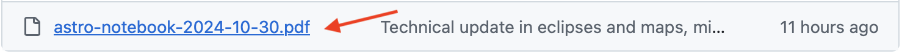
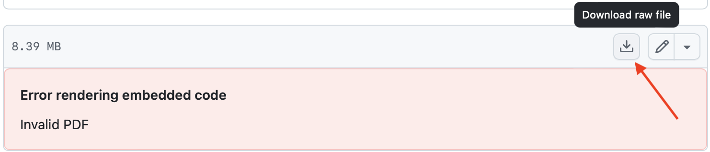
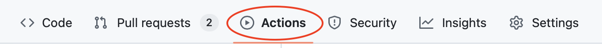
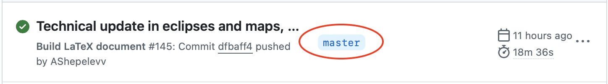
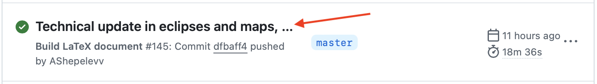
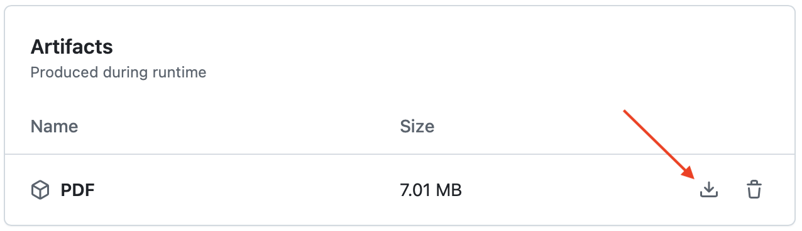
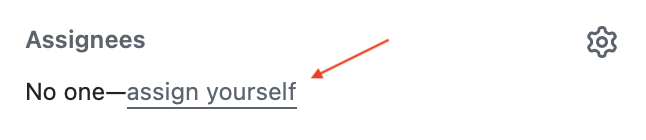

# Астрадь

В данном репозитории содержится исходный код будущего, уже третьего, издания Астради – сборника теории по астрономии. Стоит отметить, из определения Астради пропало слово "_краткий_". После печати второго издания было принято решение расширить круг тем и глубину их изложение и сделать третье, совершенно новое, издание.

### Почему исходный код стал открытым?

Я, Алексей Шепелев, основной автор Астради, к сожалению, пришёл к неутешительному выводу: вряд ли смогу самостоятельно закончить начатое. На это есть несколько причин, основная – я все меньше занимаюсь астрономией и её преподаванием, дополнительная – после окончания университета и устройства на основную работу не хватает свободного времени для поддержания должного уровня знаний в астрономии.

Однако, было бы грустно, если бы многие сотни часов работы над данным материалом были закопаны, так и не принеся пользы. Поэтому было принято решение открыть репозиторий – сделать его публичным, чтобы любой желающий мог ознакомиться с **черновиками** и, быть может, узнать для себя что-то новое.

Здесь важно подчеркнуть, что это именно черновики третьего издания. Конечно, разделы имеют разную степень готовности: некоторые готовы полностью, некоторые остались нетронуты со второго издания и требуют доработки, некоторые написаны не полностью, где-то нет логической связи с другими разделами и пр. Но я уверен, каждый сможет найти что-то интересное для себя в уже написанном. [Здесь](https://github.com/AShepelevv/astro.notebook/wiki/Содержание-с-комментариями-авторов-о-степени-готовности) находится список всех разделов с комментариями о готовности каждого. 

Мы готовы к соавторству! Подробнее см. в [соответствующем разделе](#соавторство) ниже. Давайте доделаем этот проект вместе! 

### Что нового?
Пожалуй, не буду перегружать эту страницу, а лишь скажу, что в книге появилось предисловие от авторов. Там можно подробно ознакомиться о концепции книги, о задумке и мыслях авторов. Кто готов читать исходный код в LaTeX, предисловие находится [здесь](sys/preface.tex).

### Лицензия и ограничение на использование
Этот проект распространяется по лицензии [Creative Commons Attribution-NonCommercial-ShareAlike 4.0 International (CC BY-NC-SA 4.0)](https://creativecommons.org/licenses/by-nc-sa/4.0/).

#### Атрибуция
Название проекта: Астрадь \
Год: 2024 \
Авторство: Алексей Шепелев, Святослав Суглобов, Святослав Борисов

Ниже приведены инструкции, как скачать уже собранный PDF файл, как собрать его самостоятельно, и как принять участие в написании Астради.

## Как скачать PDF

### Самый простой способ

Периодически в папку [/export](export) будут добавляться новые версии полностью скомпилированной книжки. Чтобы скачать файл,  открыв данную папку, нужно:

1. Нажать на название нужной версии 
2. В правом верхнем углу нажать на кнопку "Скачать" 

### Получить актуальную версию
Своевременное появление версий в [/export](export) не гарантировано, так как происходит вручную. Однако, в репозитории настроены автоматические действия, запускаемые при появлении нового коммита – собирается проект, и результат доступен в виде PDF. Чтобы его скачать, нужно:
1. Перейти во вкладку [Actions](https://github.com/AShepelevv/astro.notebook/actions). 
2. Если интересуют только "стабильные" версии, можно воспользоваться фильтром по ветке и указать там `master`. [Ссылка на фильтр](https://github.com/AShepelevv/astro.notebook/actions?query=branch%3Amaster) 
3. Выбрать нужную сборку, например, 
4. Внизу страницы будет блок "Artifacts", единственный артифакт – это pdf. Справа кнопка, которой можно его скачать


**_P.S._** К сожалению в публичных репозиториях артифакты хранятся не более 90 дней. Постараемся своевременно обновлять версии в `/export`, чтобы перекрывать этот промежуток

**_P.S.S._** При сборке на сервере используется флаг `useLightPlotVersion`, что означает что несколько (~4-5) иллюстраций не будут отрисованы. Однако эти иллюстрации давно пришли к своему финальному виду, и pdf в `/export` содержат их.

## Сборка

### Системные требования

* [Tex Live 2024](https://www.tug.org/texlive/acquire-netinstall.html), полная версия
* По умолчанию сборка происходит с включенным флагом `useLightPlotVersion`, что означает что несколько (~4-5) иллюстраций не будут отрисованы. Для полной сборки без флага `useLightPlotVersion` нужно увеличить доступную оперативную память для LaTeX:
  * Например, на Mac OS нужно в файл `~/Library/texmf/web2c/texmf.cnf` (создать, если его нет) записать следующее:

  ```
  main_memory = 10000000
  extra_mem_bot = 2000000
  extra_mem_top = 2000000
  param_size = 10000
  ```
* Выключить флаг `useLightPlotVersion`, указав `false` в [его определении](https://github.com/AShepelevv/astro.notebook/blob/dda242ac37eaf0d64b5b30fe7ed7aa6400e9bade/astro-notebook.tex#L18)

### Запуск
Для Linux и Mac OS достаточно запустить [скрипт](build.sh)
```bash
sh build.sh
```
На Windows нужно проделать эти действия самостоятельно.

Прогресс первой сборки (очень долгой) можно смотреть по увеливению количества файлов в папке [tikz/resource](tikz/resource). Там будет храниться локальный кэш картинок, сгенерированных с помощью TikZ.

### Nix
Альтернативно, вы можете поставить [nix](https://nixos.org) и открыть окружение для разработки командой `nix develop`. Из него вам будет доступна команда `build-notebook`, которая собирает астрадь. Если вы просто хотите собрать итоговую астрадь (с `useLightPlotVersion`), можно также вызвать `nix build`, который соберет астрадь в изолированном окружении и положит результат в папку `result`.

## Соавторство
### Список TODO
Актуальный список TODO можно посмотреть [тут](https://github.com/AShepelevv/astro.notebook/labels/todo). Добавить свою идею, правку или предложение можно, [создав issue](https://github.com/AShepelevv/astro.notebook/issues/new). После обсуждения issue попадет в список TODO.

### Канал с уведомлениями

У нас есть [Telegram канал](https://t.me/+_xvJxn3ZKVdiN2Q6) с уведомлениями о новых коммитах и issues в репозитории.

### Как сделать правку?
1. Нужно назначить issue  на себя, нажав на "assign yourself" в блоке справа 
2. Создать ветку, нажав на "Create branch" в блоке справа. Это нужно, чтобы issue автоматически привязалась к будущему PR 
2. Сделать Pull Request со своими правками в ветку `master`, будем рады обсудить правки и добавить их в книжку.

### Дополнительно
Для разработки дополнительно к пунктам из раздела [Сборка](#сборка) может понадобиться:

* [Python 3.*](https://www.python.org)
* [Jupyter Notebook](https://jupyter.org)
* [Wolfram Mathematica 14+](https://www.wolfram.com/mathematica/)
* [ipe](https://ipe.otfried.org) для правки старых иллюстрацих

## Контакты

### Алексей Шепелев

* Telegram [@ashepelevv](https://t.me/ashepelevv)
* Почта [ashepelev@phystech.edu](mailto:shepelev.as@phystech.edu)

### Святослав Суглобов

* Telegram [@suglobovs](https://t.me/suglobovs)


